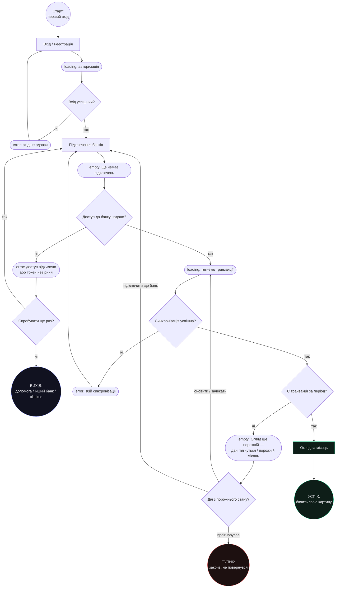
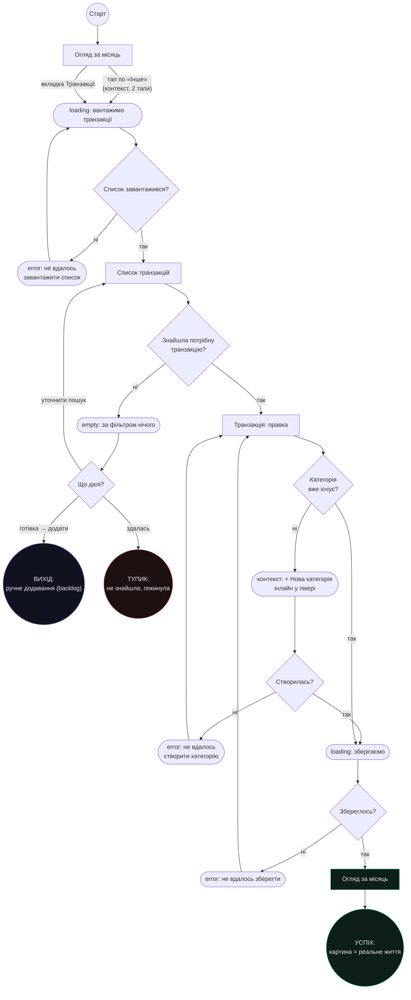
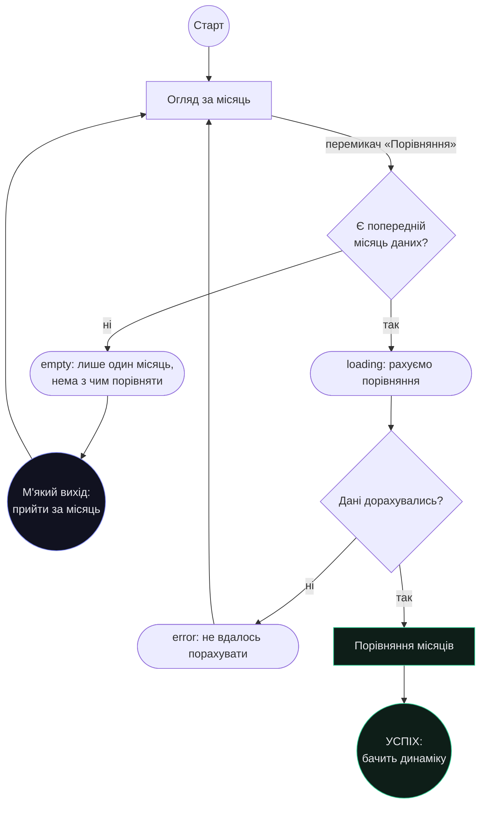

# Flows — Бабосік

> Потоки для ключових related jobs з [`../research/jtbd.md`](../research/jtbd.md).
> Візуальна версія: [`../research/ia.html`](https://baofu111.github.io/babosik/research/ia.html).
> Екрани — зі [`sitemap.md`](sitemap.md).
>
> Легенда: `[Екран]` — зі sitemap · `{Рішення?}` — розгалуження · `([Стан])` — empty/error/loading
> (стан екрана, **не** окремий екран) · `((Кінець))` — успіх / вихід / тупик.
>
> **Ревізія після розбору ІА:** додано відсутні стани (loading/error на Реєстрації, Списку,
> створенні категорії), виходи з тупиків (порожній Огляд тепер пропонує дію; AuthError має escape;
> порожній фільтр веде в ручне додавання; порожнє Порівняння повертає в Огляд), і контекстний
> вхід у RJ-2 (тап по категорії в Огляді = 2 тапи).

---

## Flow A — `RJ-1` Зібрати картину без рутини *(+ `RJ-5`, `EJ-2` — перший прохід)*

> Happy-path: Реєстрація → підключив банк → одразу бачу свою картину.
> Тупик лишається один і чесний: людина проігнорувала порожній стан і пішла.

---

## Flow B — `RJ-2` Привести картину у відповідність до свого життя

> Happy-path: помітила «Інше» → контекстний тап → знайшла → перенесла (категорію створює інлайн) → картина оновилась.
> Тупик: за фільтром нічого і здалась. Вихід: «це готівка → додати» (ручне додавання, backlog).

> **Глибина RJ-2:** контекстний вхід (тап по категорії в Огляді) = 2 тапи до правки.
> Створення категорії — інлайн у пікері, **без** переходу на екран «Категорії», тож happy-path
> лишається ≤ 3 тапів навіть коли категорії ще немає.

---

## Flow C — `RJ-4` Зрозуміти чи я змінююсь

> Happy-path: перемкнула на порівняння → бачить цей місяць проти попереднього.
> Порожній стан (один місяць даних) тепер **повертає в Огляд**, а не лишає в тупику.

---

## Звірка зі sitemap

Усі вузли-екрани присутні в [`sitemap.md`](sitemap.md) → «Екрани»: Вхід/Реєстрація, Підключення банків,
Огляд за місяць, Список транзакцій, Транзакція: правка, Категорії та підкатегорії, Порівняння місяців.
`empty / error / loading` та інлайн-створення категорії — стани й контекстні дії цих екранів, не нові екрани.
«Ручне додавання» — вихід у backlog-функцію (поза MVP-скоупом, див. sitemap → Backlog).
